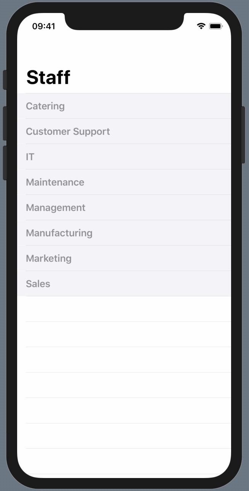

# Accordion style table in SwiftUI

In iOS projects, I have sometimes needed to use an Accordion-style table view where only zero or one sections show their rows at a time and the rest are folded up until the section header is tapped. Using UIKit, I did this with a third-party library and many, many delegate methods. 

This seemed like something that SwiftUI would do well, and it did.

## Files:

- ContentView.swift contains all the layout.
- Company.swift is the data model.
- WebService.swift gets the online data

---

## Usage:

ContentView sets up a NavigationView with two alternative views depending on whether the data has been downloaded or not.

LoadingView is a very simple text display.

DepartmentList is the interesting view but the sections and subviews are well commented.
It has a separate subview for each possible row type:

- DepartmentTableRowView to show the department names and act as the header
- PersonTableRowView to show the individual entries in each section

Both the row types are active becasue the content of each is enclosed in a Button.  
The DepartmentTableRowView toggles the accordion display.  
The PersonTableRowView toggles a `hasSignedIn` flag which will display a person icon if true.

I have not added a single animation command to this, it is all just standard animations.

---

## Change Log:

- 25th August 2019: initial release
